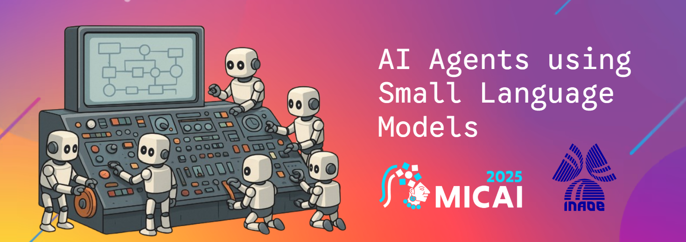

# AI Agents using Small Language Models - MICAI 2025



Welcome to the repository of the tutorial. We're happy to have you here!

Here we've packed a small collection of resources to help you get started with building AI agents using small language models. The repository is structured as follows:

- `notebooks/`: Contains all the Jupyter notebooks used in the tutorial.
- `utils/`: Here you'll find the `llama-server` binary, the inference engine you'll need if you decide to run the notebooks in Google Colab, as it was compiled for T4 instances.
- `utils_mcp/`: Contains the initial `MCP` files and the README with the API documentation that we’ll use throughout the tutorial.
- `papers/`: A collection of relevant papers and articles that provide deeper insights into the topics covered in the tutorial.
- `slides/`: The slide deck used during the tutorial presentation.

# 🚀 Getting Started

To get started, clone this repository to your local machine:

```bash
git clone https://github.com/jean-rl/agents-micai-25.git
cd agents-micai-25
```

Make sure you have the necessary dependencies installed. You can find the requirements in the `notebooks/` directory.

# ⚙️ Tutorial Structure & Requirements

The tutorial is divided into two main modules, each with different setup options and requirements.

## 🧩 1. Agents Module

You can run this module locally or using Google Colab.

`Option A — Local setup`

Requirements:

- 💻 A laptop with a capable GPU or a MacBook (M1 or higher recommended)

- 🧠 LM Studio
 — required (for running local SLMs).
 Alternatively: Ollama or 

- 🐍 Python
 (≥3.10)

- ⚡ uv
 — recommended for fast dependency management.
Alternatively: pip, venv, or conda also work

`Option B — Google Colab setup`

Requirements:

- 🌐 Google account with access to Google Colab

- ⚙️ A runtime with GPU (T4 or better)

- 🧩 The llama-server binary (already compiled for Colab; included in utils/)

## 🧠 2. MCPs Module (Model Context Protocol)

This module demonstrates interaction with local SLM.

Requirements:

- 💻 A laptop with a capable GPU or a MacBook (M1 or higher recommended)

- 🧠 LM Studio — required for local model execution
(or an equivalent desktop LLM tool with MCP's such as Claude Desktop, etc.)

- 🐍 Python environment

- ⚡ uv
 — preferred but not mandatory.
You can also use standard tools like pip or conda

# Installation
If you plan to run the notebooks locally, ensure you have Python and Jupyter installed. You can set up a virtual environment and install the required packages using uv:

### - uv
To install follow the official instructions for your OS [here](https://docs.astral.sh/uv/getting-started/installation/).

### - Inference Engine
The inference engine depends on your chosen setup:

- `Colab setup`: Please refer to the instructions in the `colab_agents.ipynb` notebook for downloading and setting up the `llama-server` binary.

- `Local setup`: Download and install LM Studio as described below.

### - LM Studio Setup

1. Download and install LM Studio from [here](https://lmstudio.ai/).
2. Download a compatible model for local inference.
We recommend: `qwen/qwen3-4b-thinking-2507` (This model offers a good balance between reasoning performance and resource efficiency.)

3. Once the model is downloaded, ensure it is loaded and running before launching the notebooks.

# Contact

If you have any questions or need further assistance, feel free to reach out to any of the tutorial organizers:

- Hugo J. Escalante [hugo.jair@gmail.com]
- Luis Arellano [arellano.luis.3c@gmail.com]
- Jeanfed Ramirez [jeanfed.ramirez@gmail.com]

We hope you find this tutorial helpful and enjoy exploring the world of AI agents with small language models!